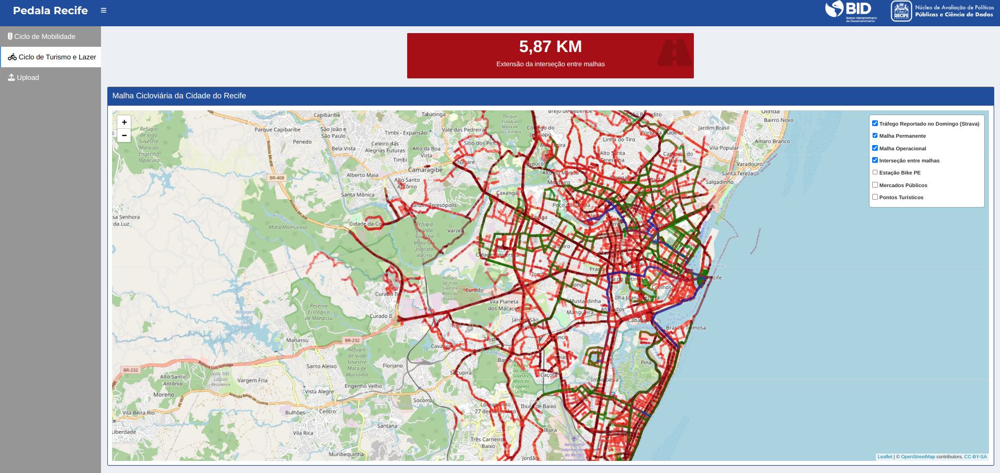
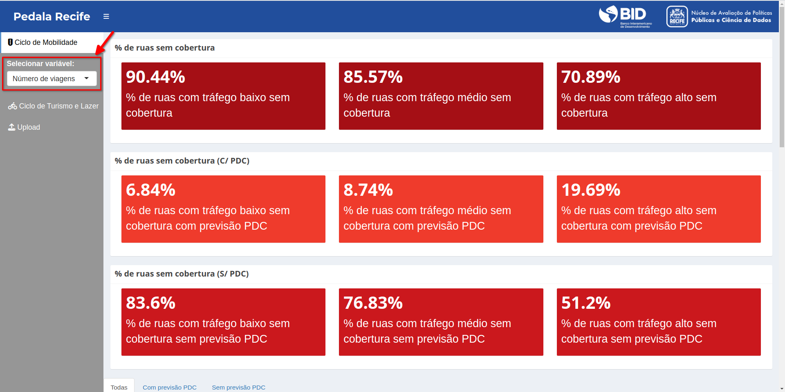
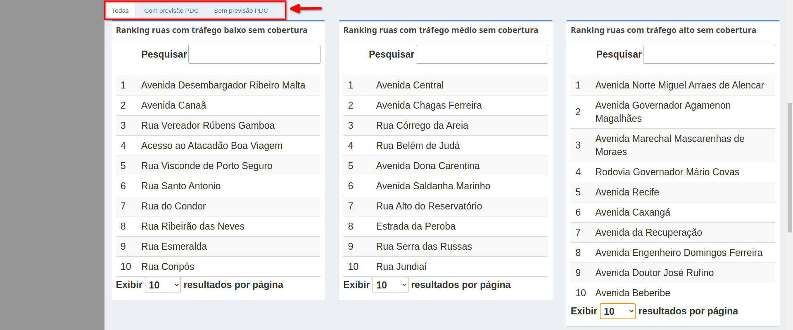
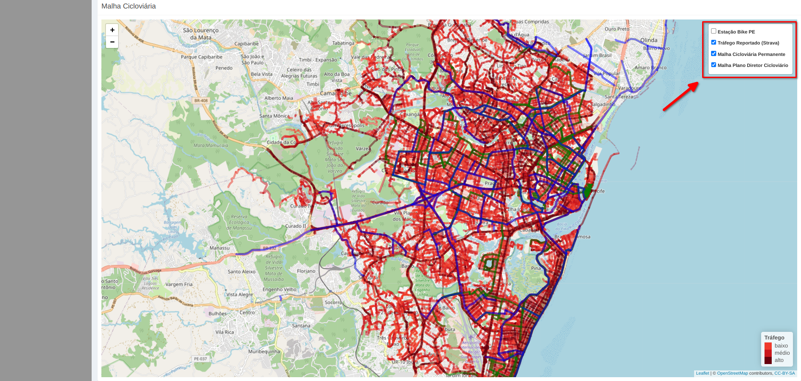
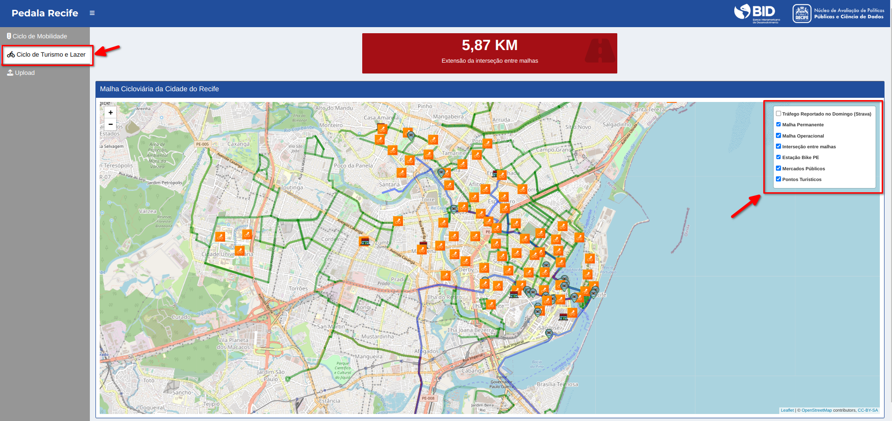

[](https://sonarcloud.io/summary/new_code?id=EL-BID_mobilidadeTurismo)

# PoC Ciclo de Mobilidade e Turismo e Lazer




## Tabela de Conteúdo:
---

- [Descrição](#descricao)
- [Guia do usuário](#guia-do-usuario)
- [Guia de instalação](#guia-de-instalacao)
- [Autores](#autores)
- [Licença](#licenca)

## Descrição <a name="descricao"></a>
---

Para contribuir para o debate sobre política de mobilidade e turismo da cidade do Refice foi uma aplicação que apresenta duas soluções sobre os temas. 

## PoC Ciclo de Mobilidade

O trânsito da cidade do Recife foi identificado como o pior do Brasil e um dos 15 piores do mundo. Recife é a capital brasileira que mais teve congestionamentos no ano de 2021.  Alguns projetos vêm sendo desenvolvidos pela prefeitura em busca de soluções para mitigar esse problema, como por exemplo a expansão da malha cicloviária da cidade. Atualmente a cidade do Recife possui o Plano Diretor Cicloviário, um plano que define as diretrizes de implementação da expansão da malha cicloviária na cidade e região metropolitana. 

A PoC Ciclo de Mobilidade utiliza o conjunto de dados **Strava Metro**, informações públicas como **OpenStreetMap** e conjunto de dados sobre a **malha cicloviária** da cidade do Recife para construir uma solução para complementar as informações do Plano Diretor Cicloviário e auxiliar no debate acerca da mobilidade na cidade do Recife. Utilizando esses conjuntos de dados é possível construir diversos indicadores, tais como:

- Nível de cobertura por malha cicloviária das vias com tráfego;
- Nível de cobertura por malha cicloviária por nível de tráfego;
- Lista de  ruas/avenidas com tráfego alto e não cobertas por malha cicloviária.


## PoC Ciclo de Turismo e Lazer

Também utilizando o conjunto de dados do **Strava Metro** como fonte de dados primária, essa solução tem como objetivo analisar como a malha cicloviária operacional complementa a malha cicloviária permanente com o intuito de fornecer maior extensão de trechos cicláveis para a população durante os Domingos e Feriados. 
Os principais objetivos dessa solução são:

- Contabilizar pontos de interseções entre a malha permanente e operacional;
- Auxiliar a Secretaria de Turismos a formular a implementação da malha cicloviária operacionais para que conecte os principais pontos turísticos da cidade.

Assim como na PoC de Ciclo de Mobilidade, foram utilizados os seguintes conjunto de dados:

- **Strava Metro**: banco de dados com informações autorreportadas dos trajetos de bicicleta dos usuários do aplicativo Strava para o ano de 2021;
- **Malha Cicloviária Permanente e Operacional**: conjunto de arquivos shape indicando a localização da malha cicloviária da cidade do Recife (ano de 2022);
- **Estações Bike PE**: conjunto de dados com a localização das estações de bicicletas compartilhadas.
- **Informações sobre Pontos Turísticos da cidade do Recife**: informações sobre alguns pontos turísticos georeferenciados da cidade do Recife;
OpenStreetMap: banco de dados de mapas, colaborativo e gratuito.


## Guia do Usuário <a name="guia-do-usuario"> </a>
---

A tela inicial da aplicação mostra a solução de **ciclo de mobilidade**. O primeiro conjunto de informações apresentados são os índices de cobertura da malha cicloviária sobre os trechos cicláveis.
Os índices são divididos por nível de tráfego nos trechos e categorizados por:

1. **% total sem cobertura**;
2. Quanto do **% total sem cobertura** possui previsão do Plano Diretor Cicloviário (C/ PDC);
3. Quanto do **% total sem cobertura** ainda sem previsão do Plano Diretor Cicloviário (S/ PDC).

Como demonstrado na Figura 4, é possível escolher a variável utilizada para fazer toda a análise. 



O segundo conjunto de informações demonstrados são os rankings da ruas sem cobertura agrupados por nível de tráfego. As ruas são ordenadas em forma decrescente a partir do volume de tráfego. Assim como anteriormente, é possível observar o ranking das ruas que possuem previsão do PDC e sem previsão do PDC.



A seguir, é demonstrado o mapa da cidade do Recife com todo o tráfego reportado (categorizado por nível de tráfego), assim como a malha cicloviária e o Plano Diretor Cicloviário. É possível selecionar quais *layer* observar no mapa. 



A seção **Ciclo de Turismo e Lazer** da aplicação demonstra a solução desenvolvida para esse tema. 
O principal objetivo dessa solução é contabilizar pontos de interseções entre a malha permanente e operacional e auxiliar a Secretaria de Turismos a formular a implementação da malha cicloviária operacionais para que conecte os principais pontos turísticos da cidade.



Semelhante ao mapa demonstrado na solução de Ciclo de Mobilidade, a Figura 7 mostra a funcionalidade do mapa, no qual é possível observar as malhas permanentes e operacionais, sua interseção, e como elas conectam os principais pontos turísticos da cidade do Recife. 

Por fim, há uma seção de **Upload** de arquivos no qual a prefeitura do Recife pode realizar as atualizações de toda a aplicação com o carregamento de novas versões dos arquivos.


## Guia de Implementação  <a name="guia-do-implementacao"> </a>
---
A implementação da aplicaçãoé bastante simples e seguirá três passos simples. São eles:

1. Download do software R e as bibliotecas necessárias;
2. Download dos códigos-fonte da aplicação;
3. Execução da aplicação.

## 1. Download de software:

A aplicação foi escrita na linguagem [R](https://www.r-project.org/) e utilizando as seguintes bibliotecas para a criação do dashboard:

- shiny;
- shinydashboard;
- shinydashboardPlus;
- shinyWidgets;
- data.table;
- tidyverse;
- lubridate;
- leaflet;	
- arrow;
- fresh;
- DT;
- sf;
- rgdal;
- raster;
- geojsonsf;
- waiter;

Após a instalação do R e das bibliotecas listadas anteriormente, o próximo é obter os arquivos da aplicação.

## 2. Clonando repositório remoto: 

É possível realizar o download dos arquivos da aplicação através do repositório remoto do GitHub. Através da linha de commando:

```sh
git clone <url>
```

## 3. Executando a aplicação:

Com os bancos de dados no formato apropriado e salvo nas respectivas pastas, basta executar o arquivo `app.R`. Através da linha de comando:

```sh
Rscript app.R
```


## Autores <a name="autores"></a>
---

- [Cleyton Farias](mailto:cleytonfarias@outlook.com "e-mail");

- [Rubens Lopes](mailto:lps.rubens@gmail.com "e-mail");


## Licença
---
